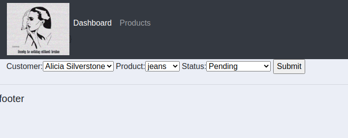

# CRM
Customer relationship management

- ### Login Page ###

 
 

- ### Admin Page with privileges ###

 
 

- ### Order Creation Page ###

 
 

- ### Order Deletion Page ###

 
 

- ### Order Updation Page ###

 
 

- ### Customer Page ###

 
 

- ### Customer order details ###

 
 

- ### Customer Profile ###

